# Obsidian Agent Mode: PRD & Implementation Plan

## 1. Product Requirements Document (PRD): MVP

### 1.1. Vision

Transform Obsidian from a passive note-taking tool into an active, intelligent knowledge partner. By introducing a Cursor-like Agent Mode, users can issue complex commands in natural language, which an AI Agent will execute by automating research, writing, refactoring, and planning tasks directly within the Obsidian Vault.

### 1.2. Target User

Power users, researchers, writers, and anyone who heavily relies on Obsidian for knowledge work and wants to maximize their efficiency.

### 1.3. MVP Core Features

| Feature Module                 | Description                                                                                                                                                                                                                                       |
| :------------------------------- | :-------------------------------------------------------------------------------------------------------------------------------------------------------------------------------------------------------------------------------------------------- |
| **Agent Core Loop**            | Implement`streamAgentChat` in `main.ts`. The Agent must be able to reason (think/plan), select one or more tools, execute them, observe the results, and decide the next action until the task is complete.                                       |
| **Structured Tool-Calling**    | The AI model must output tool calls in a standardized JSON format (`tool_calls`), not as plain text. This is critical for reliable parsing and execution.                                                                                         |
| **Tool Execution & Feedback**  | The system must parse`tool_calls`, securely execute the corresponding tool functions in `main.ts` (e.g., `toolReadNote`, `toolEditNote`), and return the results to the model in a structured `tool_result` format.  E.g Tood Edit           |
| **Frontend Visualization**     | Enhance`ReactView.tsx` to visualize the Agent's workflow, including its thoughts (if available), the tool being called with its parameters, and the result of the execution (success or failure).                                                 |
| **System Prompt Enhancement**  | Design a robust system prompt based on best practices from`./research/ai-prompts/`. It must clearly define the Agent's role, available tools with their schemas (name, description, parameters), and guiding principles for reasoning and action. |
| **Context Awareness (@files)** | The Agent must be aware of files attached via the`@` mention in the input. The `getSystemPrompt` function must incorporate the content of these files into the context provided to the model.                                                     |

### 1.4. Out of Scope (Post-MVP)

- External tool integrations (Jira, Slack, Calendar).
- Advanced multi-agent orchestration (Agent Fleet).
- Interactive UI feedback on agent steps (e.g., emoji reactions, threaded replies).
- Proactive suggestions and alerts initiated by the agent.

---

## 2. Technical Plan & Task Breakdown

### 2.1. Core Architecture

The implementation will follow a standard **ReAct (Reason + Act)** agent architecture, orchestrated by the `streamAgentChat` function.

```mermaid
sequenceDiagram
    participant User
    participant ReactView.tsx as Frontend
    participant main.ts as Backend/Plugin
    participant OpenAI API

    User->>Frontend: Enters command "Refactor note A based on note B"
    Frontend->>Backend/Plugin: Calls streamAgentChat(messages, contextFiles)
    Backend/Plugin->>OpenAI API: Sends (System Prompt + Chat History + User Input + Tools)
    OpenAI API-->>Backend/Plugin: Returns stream (including `tool_calls` JSON)
  
    Backend/Plugin->>Backend/Plugin: Parses `tool_calls` (e.g., readNote('B.md'))
    Frontend->>Frontend: (Concurrently) Renders "🔧 Using tool: readNote"
    Backend/Plugin->>Backend/Plugin: Executes readNote('B.md')
    Backend/Plugin->>Frontend: Updates UI with tool status (success/failure + result preview)
  
    Backend/Plugin->>OpenAI API: Sends `tool_result`
    OpenAI API-->>Backend/Plugin: Returns stream (more reasoning or final answer)
    Backend/Plugin->>Frontend: Streams final text response to UI
    Frontend->>User: Displays full agent trace and final result
```

#### 2.2. Implementation Tasks

Here is a step-by-step breakdown of the engineering tasks required to build the MVP.

#### **Phase 1: Foundation - System Prompt & Model Interaction**

- [X] **Task 1.1: Enhance `getSystemPrompt` for Agent Behavior**

  - **File:** `main.ts`
  - **Objective:** Modify the `getSystemPrompt` function to create a detailed prompt that instructs the model to act as a reasoning agent.
  - **Acceptance Criteria:**
    - The prompt must clearly define the ReAct loop: Think, Act, Observe.
    - It must instruct the model to use a JSON format for tool calls, specifying the tool name and arguments.
    - It should reference best practices from `research/ai-prompts/Cursor Prompts/Agent Prompt v1.0.txt`.
- [ ] **Task 1.2: Define Tool Schemas in System Prompt** (John, 06.17 Week)

  - **File:** `main.ts`
  - **Objective:** Within `getSystemPrompt`, dynamically generate and include the schemas for all available tools (e.g., `toolVaultSearch`, `toolReadNote`, `toolEditNote`, etc.).
  - **Acceptance Criteria:**
    - Each tool schema must include its `name`, a clear `description` of what it does, and a JSON schema for its `parameters`.
    - This should be formatted exactly as the OpenAI API expects for its `tools` parameter.
    - This replaces hardcoding tool usage instructions with a structured, machine-readable format.
- [X] **Task 1.3: Integrate `@file` Context into Prompt**

  - **File:** `main.ts`
  - **Objective:** Update `getSystemPrompt` to incorporate the content of files provided via the `@` mention.
  - **Acceptance Criteria:**
    - The prompt should include a dedicated section, like `### Context from Attached Files ###`, followed by the content of each attached file.
    - The `buildContextContent` helper function can be used for this.

#### **Phase 2: Core Logic - The Agent Loop**

- [X] **Task 2.1: Implement the `streamAgentChat` Loop**

  - **File:** `main.ts`
  - **Objective:** Flesh out the `streamAgentChat` function with a `while` loop to manage the multi-step conversation with the model.
  - **Acceptance Criteria:**
    - The function should maintain a `messages` array representing the conversation history with the model, including user, assistant, and tool messages.
    - The loop continues as long as the model returns `tool_calls`.
    - The loop terminates when the model returns a `stop` reason.
- [X] **Task 2.2: Make Initial API Call with Tools**

  - **File:** `main.ts`
  - **Objective:** Inside `streamAgentChat`, make the first call to the OpenAI `chat.completions.create` endpoint.
  - **Acceptance Criteria:**
    - The call must include the `tools` parameter, populated by the schemas from Task 1.2.
    - The call must set `tool_choice` to `"auto"` to let the model decide when to use tools.

#### **Phase 3: Action - Tool Dispatch & Execution**

- [X] **Task 3.1: Parse `tool_calls` Response**

  - **File:** `main.ts`
  - **Objective:** When the model responds with `finish_reason: 'tool_calls'`, correctly parse the `tool_calls` array from the response.
  - **Acceptance Criteria:**
    - The code must handle cases where one or more tool calls are requested in a single response.
    - The arguments for each function, which are in a stringified JSON format, must be safely parsed.
- [X] **Task 3.2: Create a Secure Tool Dispatcher**

  - **File:** `main.ts`
  - **Objective:** Create a helper function or a `switch` statement that takes a parsed tool call and executes the corresponding `tool...` function.
  - **Acceptance Criteria:**
    - The dispatcher must map the `function.name` from the tool call to the actual TypeScript function.
    - It should pass the parsed arguments to the function.
    - It must include error handling for unknown tool names.
- [X] **Task 3.3: Execute Tools and Collect Results**

  - **File:** `main.ts`
  - **Objective:** After dispatching, execute the tool functions and capture their return values.
  - **Acceptance Criteria:**
    - The results (or any errors thrown) must be collected for each tool call.
    - Each result must be formatted into a `tool` message object, including the `tool_call_id` and the `content` (the return value as a string).
- [X] **Task 3.4: Send Tool Results Back to Model**

  - **File:** `main.ts`
  - **Objective:** Append the `tool` message(s) to the conversation history and send it back to the model for the next step in the loop.
  - **Acceptance Criteria:**
    - A new API call is made with the updated `messages` array, containing the tool results.
    - This allows the model to "observe" the outcome of its actions.

#### **Phase 4: Frontend - Visualization**

- [X] **Task 4.1: Refactor `streamAgentChat` for Structured Streaming**

  - **File:** `main.ts`
  - **Objective:** Modify `streamAgentChat` to yield structured data objects to the frontend instead of raw text chunks.
  - **Acceptance Criteria:**
    - Define an interface for the streamed data, e.g., `type AgentStreamEvent = { type: 'thought' | 'tool_call' | 'tool_result' | 'text_chunk', data: any }`.
    - The `onChunk` callback in `ReactView.tsx` should now be an `onEvent` callback that receives these objects.
- [ ] **[TO BE IMPROVED] Task 4.2: Enhance `ReactView.tsx` to Render Agent Steps** (John)

  - **File:** `ReactView.tsx`
  - **Objective:** Update the `handleSendMessage` function and the message rendering logic to process the new structured stream.
  - **Acceptance Criteria:**
    - When an event with `type: 'tool_call'` is received, update the `currentToolSession` state to show the tool call is pending.
    - When an event with `type: 'tool_result'` is received, update the corresponding tool step in `currentToolSession` with the result.
    - The `renderToolSteps` function should be updated to display this information clearly.
    - Final assistant text (`type: 'text_chunk'`) should be appended to the final assistant message.

#### **Phase 5: Testing & Validation** (Ernie: Testing examples, list functionalities or UI/UX suggestions)

- [ ] **Task 5.1: Create Test File for Agent Logic**

  - **File:** `tests/agent.test.js` (or similar)
  - **Objective:** Set up a new test file for agent-related functionality.
  - **Acceptance Criteria:**
    - The file is created and configured to run within the existing test suite.
- [ ] **Task 5.2: Write Unit Tests for Tool Dispatcher**

  - **File:** `tests/agent.test.js`
  - **Objective:** Write tests to verify the tool dispatcher.
  - **Acceptance Criteria:**
    - Mocks the OpenAI response with a sample `tool_calls` object.
    - Asserts that the correct `tool...` function is called with the correct arguments.
- [ ] **Task 5.3: Write Integration Test for a Simple Agent Task**

  - **File:** `tests/agent.test.js`
  - **Objective:** Test the entire agent loop for a simple, self-contained task.
  - **Acceptance Criteria:**
    - A test case like "Read the file 'test.md' and tell me the first line" is simulated.
    - Mocks the OpenAI API to respond first with a `tool_call` to `toolReadNote` and then with a final answer.
    - Asserts that the final streamed response is the expected answer.
